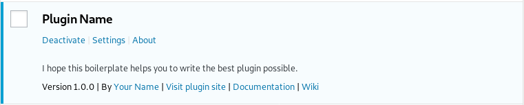

  

# WordPress Plugin Boilerplate

Boilerplate for building WordPress plugins.

## Fundamental

* [Build seven good object-oriented habits in PHP](https://developer.ibm.com/articles/os-php-7oohabits/)

## Requirements

* PHP version 7.0 or greater
* WordPress 5.0 or greater
* Docker 18.06 or greater (Development)
* Grunt 1.0.4 (Development)

## Features

### PHP Standards Recommendations

* [PSR-1: Basic Coding Standard](https://www.php-fig.org/psr/psr-1/)
* [PSR-12: Coding Style Guide](https://www.php-fig.org/psr/psr-12/)
* [PSR-4: Autoloader](https://www.php-fig.org/psr/psr-4/)

### WordPress

* Settings page
* About page
* Contextual Help
* Plugin action links

## Install

### Composer

    composer create-project --no-install --remove-vcs arya/wordpress-plugin your-plugin dev-master
    cd your-plugin

You'll need to rename

1. The directory `plugin-name` to `your-plugin`
1. The file `plugin-name.php` to `your-plugin.php`

Then find and replace in all the templates

1. `plugin-name` to `your-plugin`
1. `plugin_name` to `your_plugin`
1. `PLUGIN_NAME` to `YOUR_PLUGIN`
1. `PluginName` to `YourPlugin` (Namespace)

If you are a Linux or macOS user, you can use the command `sed`

    egrep -lRZ 'plugin-name' . | xargs -0 -l sed -i -e 's/plugin-name/your-plugin/g'

Finally, edit the composer.json file to declare plugin dependencies

    composer install --prefer-dist

Happy Coding!

### Grunt

Install Grunt

    [sudo] npm install --global grunt-cli
    npm install --silent

Build (Minify resources)

    grunt

Handle the version of the plugin

    grunt version

### Docker

Create and start the container

    docker-compose up -d
    docker exec your-plugin chown -R www-data:www-data /var/www/html
    sudo chown -R $USER:$USER your-plugin

Stop and remove containers, networks, images, and volumes

    docker-compose down --volumes

## License

This project is licensed under the GNU General Public License, Version 2.0.
See [LICENSE](LICENSE) for the full license text.
